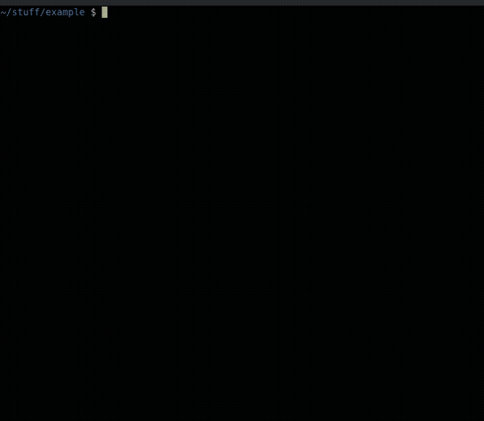
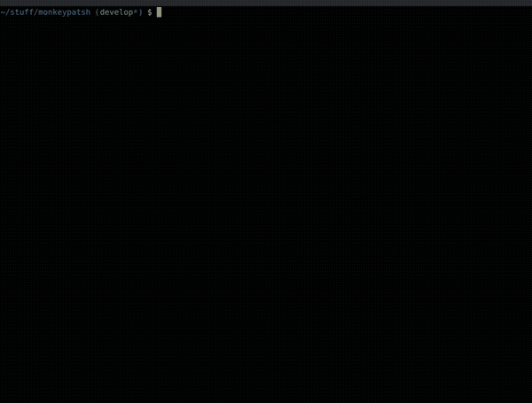
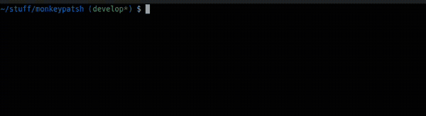
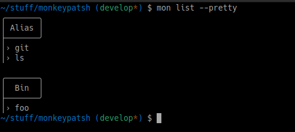

<div align="center">
  
</div>

<br />
<div align="center">Streamline shell monkey patching</div>

$${\color{grey}Pure \space Bash \space · \space  Linux \space and \space macOS}$$

## Index
- [What is Monkeypatsh?](#what-is-monkeypatsh)
  - [Example 1: Make `npm run <script>` always log the datetime to a file](#example1)
  - [Example 2: Make `git add` always do a `git status`](#example2)
  - [Example 3: Patch `--foo` to `ls`](#example3)
- [What is NOT Monkeypatsh?](#what-is-not-monkeypatsh)
- [How to Install](#how-to-install)
  - [OS Support](#os-support)
  - [bash](#bash-install)
  - [zsh](#zsh-install)
- [Usage](#examples)
  - [Register commands](#examples-register)
  - [Patch behavior](#examples-patch)
  - [Edit commands](#examples-edit)
  - [List commands](#examples-list)
  - [Unregister commands](#examples-unregister)
  - [Backup and Restore](#examples-backup)
  - [Help](#examples-help)
- [Tests](#how-to-test)
- [Completions](#completions)
  - [Known `fzf` issue in `bash`](#fzf-issue)
- [Custom configuration](#configuration)
- [Contributing](#contributing)
- [License](#license)
- [Uninstall](#uninstall)

---------------------------------------


<a name="what-is-monkeypatsh"></a>
## What is Monkeypatsh?

Monkeypatsh is a tool for easily monkey patching commands in the shell.

It wraps any command you register with it, `npm`, `git`, `ls`, `docker`... or something you wrote yourself, and lets you attach custom behavior to any existing or new subcommands, flags, or default invocation, while keeping the command's API intact.

It centralizes all your patches under one tool and extends the original completion with them.

And you choose whether these patches stay only in your interactive shell, or are globally available through the `$PATH` variable.

<a name="example1"></a>
### Example 1: Make `npm run <script>` always log the datetime to a file
```bash
# Register npm
mon register npm
mon patch npm run   # editor will open up
```

```bash
# Inside the editor
...
local script="$1"
echo "Ran '$script' on $(date)" >> runs.log
\npm run "$script"
...
```



<a name="example2"></a>
### Example 2: Make `git add` always do a `git status`
> [!NOTE]
> We all know `git add`. It doesn't run `status` by default. Some say we should use a git alias for this like this [S.O. answer](https://stackoverflow.com/a/17969370/14113064). But git aliases do not allow you to define aliases that [clash with its API](https://stackoverflow.com/q/3538774/14113064), meaning you can't do a `git alias.add`, that's why we endup defining unnatural aliases like `git myadd`.
>
> It also feels awkward to define a shell alias `gas` for it.
>
> I just want the same git API I'm used to with some tweaks. Is that too much to ask?

```bash
# Register git
mon register git
mon patch git add   # editor will open up
```

```bash
# Inside the editor
...
\git add "$@"
\git status
...
```


<a name="example3"></a>
### Example 3: Patch `--foo` to `ls`
Monkeypatsh also lets you patch new subcommands and flags:
```bash
mon register ls
mon patch ls --foo [code]
```


<a name="example3.1"></a>
#### It would be nice to have `--foo` be auto completed...
It does, and it also preserves the original completion!
```bash
ls --f[tab]    # → completes `ls --foo`
ls --au[tab]   # → completes `ls --author`
```

---------------------------------------


<a name="what-is-not-monkeypatsh"></a>
## What is NOT Monkeypatsh?

- **Not a general bash CLI framework**:\
  Although [you can create new commands from scratch](#you-can-create-new-commands-from-scratch), Monkeypatsh mainly aims at **patching existing** commands.

  Tools like [argc](https://github.com/sigoden/argc) help you *build* new CLIs with extended support for argument parsing, help generation, and subcommand routing. Monkeypatsh excels in *patching existing commands*, although it has support for new commands too.

- **Not git aliases**:\
  Git aliases [do not allow](https://stackoverflow.com/q/3538774/14113064) you to define aliases that clash with its API, meaning you can't do a `git alias.status` for example, and they only work inside git.

  Monkeypatsh lets you patch existing command APIs and works on any command `ls`, `docker`, `kubectl`, `git`, `npm`... or something you wrote yourself.

- **Not a function library**:\
  You don't source it into your scripts. You register commands once and they just work.


---------------------------------------


<a name="how-to-install"></a>
## How to Install

<a name="os-support"></a>
### OS Support
Works on `Linux` and `macOS`.

<a name="bash-install"></a>
- bash:

  ```bash
  git clone https://github.com/solisoares/monkeypatsh
  cd monkeypatsh
  bash install.sh
  source ~/.bashrc
  ```

<a name="zsh-install"></a>
- zsh:

  ```zsh
  git clone https://github.com/solisoares/monkeypatsh
  cd monkeypatsh
  bash install.sh
  source ~/.zshrc
  ```

**For contributors / development:**

```bash
bash install.sh --dev
```

`--dev` symlinks the source directory instead of copying it, so changes to the source take effect immediately without reinstalling.

---------------------------------------

<a name="examples"></a>
## Usage
> [!NOTE]
> For a complete usage reference, see the help docs: `mon help`

<a name="examples-register"></a>
### Register commands
To start patching commands, register them with Monkeypatsh first.

> [!NOTE]
> When registering commands, you can choose how to make them available by registering them as **aliases** or **binaries**.
> Aliases are available in interactive sessions.
> Binaries are exposed in `$PATH` and are available anywhere.

#### Registering an existing command
> [!TIP]
> The default registration method is to register commands as aliases so they are not shadowed in scripts. You can change this in the [custom configs](#custom-configuration)

```bash
# Register `ls` as a Monkeypatsh alias
mon register ls

# You can pass the `--alias` flag also
mon register --alias ls
```

<a name="you-can-create-new-commands-from-scratch"></a>
#### Registering new commands
To create new commands from scratch leveraging Monkeypatsh capabilities, register them as binary.
```bash
mon register --bin foo
```

<a name="examples-patch"></a>
### Patch behavior
You can pass inline code for simple cases or invoke your preferred editor for complex cases.
> [!TIP]
> You can change the default editor used in the [custom configs](#custom-configuration)

#### Default behavior
When called with the `--default` flag, Monkeypatsh patches the default execution.
```bash
mon register pip
mon patch --default pip '\pip "$@" && echo "bye!"'

mon register --bin foo
mon patch --default foo 'echo "foo says: $@"'
```

#### Inline patch
```bash
mon register ls
mon patch ls -la '\ls -la | more'

mon register --bin foo
mon patch foo --bar 'echo bar!'
```

#### Interactive patch
Example: Decorate `git status` with a start and end message
```bash
mon register git
mon patch git status   # editor will open up
```
```bash
# Inside the editor
...
echo "--- start ---"
\git status "$@"
echo "--- end ---"
...
```


<a name="examples-edit"></a>
### Edit commands
Not happy with the current patch or default execution? Edit it:
> [!TIP]
> You can change the default editor used in the [custom configs](#custom-configuration)

```bash
# mon register npm
# mon patch npm install [code]
mon edit npm
mon edit npm install
```

<a name="examples-list"></a>
### List commands
List registered commands and their patches.

##### Recursive Pretty List
> [!TIP]
> This is the default listing. You can change the default in the [custom configs](#custom-configuration)

List commands and their patches
```bash
# Recursive is the default
mon list

# You can pass the flag also
mon list --recursive
```


##### Pretty List
List registered commands
```bash
mon list --pretty
```



##### Flat
List registered commands in flat format
```bash
mon list --flat
```


##### Aliases
List registered alias commands
```bash
mon list --alias
```


##### Binaries
List registered binary commands
```bash
mon list --bin
```


##### Command patches
List patches of registered commands
```bash
mon list <cmd>
```


<a name="examples-unregister"></a>
### Unregister commands
```bash
mon unregister docker
mon unregister --all
mon unregister --alias
mon unregister --bin
```

<a name="examples-backup"></a>
### Backup and Restore
Are you going to install Monkeypatsh on another machine or reset your computer? Back up the current state:
```bash
mon backup                        # saves to ~/.mon.bak.<date>.tar
mon backup --file ~/my-backup.tar

mon restore ~/my-backup.tar
```

<a name="examples-help"></a>
### Help
```bash
mon help                  # full help
mon help --short          # brief summary of commands and options
mon help register         # help for a specific command
```

---------------------------------------


<a name="how-to-test"></a>
## Tests
The `tests.sh` covers the standard flow for Monkeypatsh and bash completions.

```bash
# Install and source monkeypatsh, then:
bash tests.sh
```


---------------------------------------


<a name="completions"></a>
## Completions

There are shell completions for `bash` and `zsh`.

They are set up automatically on install and sourced via `~/.monrc`.

When you register a new command, completions for its patches are added automatically with no refresh needed.
> [!NOTE]
> Any pre-existing completions are kept alongside the patches!

State of completions:

| Shell | Completions | Tested                                                              |
|:-----:|:-----------:|---------------------------------------------------------------------|
| bash  | Yes         |  programmatically tested                                             |
| zsh   | Yes         |  manually tested  &nbsp;&nbsp; ¯\\\_(ツ)\_/¯ &nbsp; _(help needed)_ |


The test script programmatically tests `bash` completions for both Monkeypatsh and its registered commands.

`zsh` completions work just as well, but there are no **programmatic** tests for it yet.


<a name="fzf-issue"></a>
### Known `fzf` issue in `bash`

> [!NOTE]
> This is **not** an issue in `zsh`.

When a Monkeypatsh registered command has also enabled fzf completion and you re-source your `~/.bashrc` file (session refresh), due to how Monkeypatsh completions are sourced, fzf will recursively call itself making the session crash.

The fix: To prevent fzf from recursively calling itself on a session **refresh**, set up fzf **after** Monkeypatsh.
```bash
#~/.bashrc
...

# Monkeypatsh setup
if [ -f ~/.monrc ]; then source ~/.monrc; fi

# fzf setup
eval "$(fzf --bash)"
_fzf_setup_completion [type] cmds...

...
```


---------------------------------------


<a name="configuration"></a>
## Custom configuration

Monkeypatsh is configured via `~/.monconfig`. Edit it with:

```bash
mon edit --config
```

> [!NOTE]
> These only affect default behavior. Explicit flags always take precedence.

| Key | Values | Default | Description |
|-----|--------|---------|-------------|
| `register_mode` | `alias` \| `bin` | `alias` | Default registration type when no arguments. Use `alias` for patching existing commands in interactive shells. Use `bin` for new commands that should also work in scripts. |
| `list_mode` | `pretty` \| `flat` \| `recursive` | `recursive` | Default output of `mon list` with no arguments. |
| `editor` | any editor command | `$EDITOR` or `vi` | Editor used by `mon patch` and `mon edit`. |


---------------------------------------


<a name="contributing"></a>
## Contributing
Issues, PRs and Discussions are all welcome. Feel free to contribute in any way!


---------------------------------------


<a name="license"></a>
## [License](./LICENSE)
The MIT License (MIT)

Copyright (c) 2026 Alexandre Soli Soares


---------------------------------------


<a name="uninstall"></a>
## Uninstall
You can uninstall Monkeypatsh by running:
```bash
mon uninstall
```

Or you can execute the uninstall script directly from the source directory:
```bash
bash uninstall.sh
```
