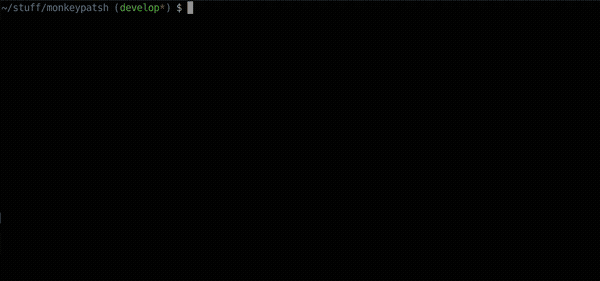
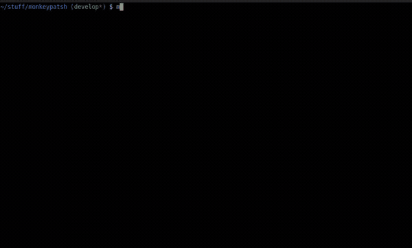
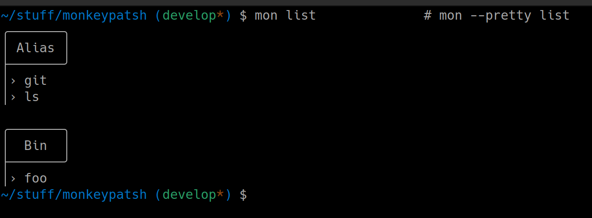
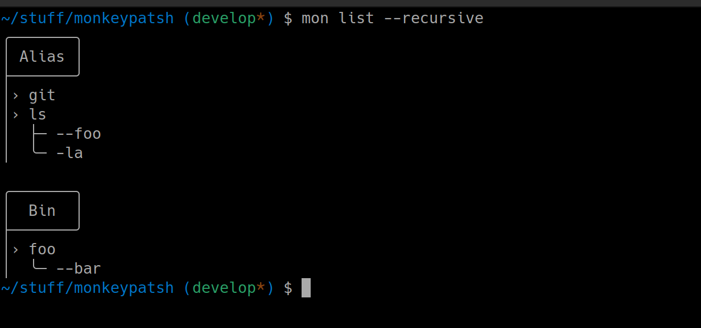
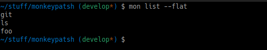
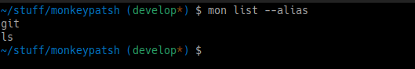
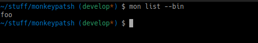
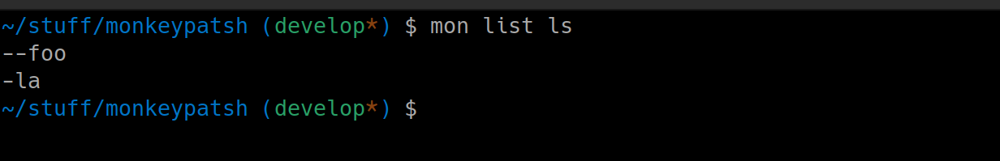

<div align="center">
  
</div>

<br />
<div align="center">Monkey patch any command in the Shell</div>

$${\color{grey}Pure \space Bash \space · \space  Linux \space and \space macOS}$$

## Index
- [What is Monkeypatsh?](#what-is-monkeypatsh)
  - [Why not just use aliases](#why-not-just-use-aliases)
  - [What if you want to add `--foo` to `ls`](#what-if-you-want-to-patch-ls-foo)
  - [It would be nice to have `--foo` be auto completed](#it-would-be-nice-completion)
  - [You can create new commands from scratch](#you-can-create-new-commands-from-scratch)
- [What is NOT Monkeypatsh?](#what-is-not-monkeypatsh)
- [How to Install](#how-to-install)
  - [OS Support](#os-support)
  - [bash](#bash-install)
  - [zsh](#zsh-install)
- [Examples](#examples)
  - [Register commands](#examples-register)
  - [Patch behavior](#examples-patch)
  - [Edit commands](#examples-edit)
  - [List commands](#examples-list)
  - [Unregister commands](#examples-unregister)
  - [Backup and Restore](#examples-backup)
- [Tests](#how-to-test)
- [Completions](#completions)
  - [Known `fzf` issue in `bash`](#fzf-issue)
- [Custom configuration](#configuration)
- [Contributing](#contributing)
- [License](#license)

---------------------------------------


<a name="what-is-monkeypatsh"></a>
## What is Monkeypatsh?

Monkeypatsh lets you patch commands with custom behavior — without renaming them, without writing wrapper scripts from scratch, and without cluttering your `.bashrc` with functions.

<a name="why-not-just-use-aliases"></a>

### Why not just use aliases?
Once upon a time a user asked why `alias 'ls -la'='ls -la | more'` didn't work.
> *In my .bashrc I attempted `alias 'ls -la'='ls -la | more'`. It does not work.*
> — [superuser.com/questions/105375](https://superuser.com/questions/105375)

Turns out bash aliases do not support space in their name definition.
The common answer is then to use an alias: `alias lsm='ls -la | more'` — but now you have a new name to memorise, and it won't trigger on `ls -al` or any other flag variation.

Another approach is to define a new `ls` function — although valid, it now **shadows** the original command inside scripts, only covers the specific `-la` flag again, and scales poorly:

```bash
# This function works but shadows the original `ls`
ls() {
  if [[ $@ == "-la" ]]; then
    \ls -la | more
  else
    \ls "$@"
  fi
}
```

Monkeypatsh is the structured version of that approach:
```bash
# Patch `ls`
mon register ls
mon patch ls -la 'command ls -la |  more'

# Better yet
mon patch ls -la 'command ls -la "$@" |  more'

# Even better: Prefer the interactive declaration for complex executions
mon patch ls -la    # → Opens editor
...
function _mon_-la() {
    echo "--- start  ---"
    \ls -la "$@" |  more
    echo "--- end ---"
}
...
```

Now the `ls -la` patch works in an interactive session.
```bash
# --- In an interactive session ---
ls -la    #  →  \ls -la | more
ls -al    #  →  \ls -al | more

# --- In a non interactive session works as normal ---
ls -la    #  →  ls -la
ls -al    #  →  ls -al
```

<a name="what-if-you-want-to-patch-ls-foo"></a>

### What if you want to add `--foo` to `ls`
Simple:
```bash
mon patch ls --foo [code]
```

<a name="it-would-be-nice-completion"></a>

### It would be nice to have `--foo` be auto completed
But it does, and it also preserves the original completion!
```bash
ls --f[tab]   # → completes `ls --foo`
ls --au[tab]   # → completes `ls --author`
```

<a name="you-can-create-new-commands-from-scratch"></a>

### You can create new commands from scratch too
```bash
# To use new commands in scripts, register as a binary
mon register --bin foo
```


---------------------------------------


<a name="what-is-not-monkeypatsh"></a>

## What is NOT Monkeypatsh?

- **Not a general bash CLI framework**: Although [you can create new commands from scratch](#you-can-create-new-commands-from-scratch), Monkeypatsh mainly aims at **patching existing** commands.

  Tools like [argc](https://github.com/sigoden/argc) help you *build* new CLIs with argument parsing, help generation, and subcommand routing. Monkeypatsh excels in *patching existing commands* although it has support for new commands too.

- **Not git aliases.**
`git` aliases only work inside git. Monkeypatsh works on any command — `ls`, `docker`, `kubectl`, `git`, `npm`... or something you wrote yourself.

- **Not a function library.**
You don't source it into your scripts. You register commands once and they just work.


---------------------------------------


<a name="how-to-install"></a>

## How to Install

<a name="os-support"></a>

### OS Support
Works on `Linux` and `macOS`

<a name="bash-install"></a>
- bash:

  ```bash
  git clone https://github.com/solisoares/monkeypatsh
  cd monkeypatsh
  ./install.sh
  source ~/.bashrc
  ```

<a name="zsh-install"></a>
- zsh:

  ```zsh
  git clone https://github.com/solisoares/monkeypatsh
  cd monkeypatsh
  ./install.sh
  source ~/.zshrc
  ```

**For contributors / development:**

```bash
bash install.sh --dev
```

`--dev` symlinks the source directory instead of copying it, so changes to the source take effect immediately without reinstalling.


---------------------------------------


<a name="how-to-test"></a>

## Tests
The `tests.sh` covers the standard flow for monkeypatsh and bash completions.

```bash
# Install and source monkeypatsh, then:
bash tests.sh
```



---------------------------------------


<a name="completions"></a>

## Completions

There are shell completions for `bash` and `zsh`.

They are set up automatically on install and sourced via `~/.monrc`.

When you register a new command, completions for its patches are added automatically — no refresh needed.
> Any pre-existing completions are kept alongside the patches!

| Shell | Completions | Tested                                                              |
|:-----:|:-----------:|---------------------------------------------------------------------|
| bash  | Yes         |  programmatically tested                                             |
| zsh   | Yes         |  manually tested  &nbsp;&nbsp; ¯\\\_(ツ)\_/¯ &nbsp; _(help needed)_ |


The test script programmatically tests `bash` completions — both for Monkeypatsh and its registered commands.

`zsh` completions work just as well, but there are no **programmatic** tests for it yet.


<a name="fzf-issue"></a>

### Known `fzf` issue in `bash`

> [!NOTE]
> To prevent fzf recursive call itself on a session **refresh**, setup fzf **after** Monkeypatsh

When the Monkeypatsh registered command has also enabled fzf completion and you re-source your `~/.bashrc` file (session refresh), due to how Monkeypatsh completions are sourced fzf will recursive call itself making the session crash.

The fix:
```bash
...

# Monkeypatsh setup
if [ -f ~/.monrc ]; then source ~/.monrc; fi

# fzf setup
eval "$(fzf --bash)"
_fzf_setup_completion [type] cmds...

...
```

This is **not** an issue in `zsh`

---------------------------------------

<a name="examples"></a>

## Examples

<a name="examples-register"></a>

### Register commands
To start patching behavior to commands, register them with Monkeypatsh first.

#### Registering an existing command
If you want to patch behavior to **existing** commands, it's wise not to shadow them. To protect against shadowing, the default registration method is to register the command as an alias.
> You can change the default registration method in the [custom configs](#custom-configuration)

```bash
# Register `ls` as a Monkeypatsh alias
mon register ls

# Or passing the `--alias` flag explicitly
mon register --alias ls
```

#### Registering new commands
To create new commands from scratch leveraging Monkeypatsh capabilities, register them as a binary
```bash
mon register --bin foo
```

<a name="examples-patch"></a>

### Patch behavior
You can pass inline code for simple cases or invoke your preferred editor for complex cases.
> You can change the default editor used in the [custom configs](#custom-configuration)

#### Inline patch
```bash
mon register ls
mon patch ls -la '\ls -la | more'

mon register --bin foo
mon patch foo --bar 'echo bar!'
```

#### Interactive patch
```bash
mon register git
mon patch git status
```


<a name="examples-edit"></a>

### Edit commands
Not happy with the current patch or default execution? Edit it:
> You can change the default editor used in the [custom configs](#custom-configuration)
```bash
# mon register git
# mon patch git stash [code]
mon edit git
mon edit git stash
```

<a name="examples-list"></a>

### List commands
List registered commands and their patches

##### Pretty List
> This is the default listing. You can change the default in the [custom configs](#custom-configuration)



##### Recursive List


##### Flat


##### Aliases


##### Binaries


##### Command


<a name="examples-unregister"></a>

### Unregister commands
```bash
mon unregister git
mon unregister --all
mon unregister --alias
mon unregister --bin
```

<a name="examples-backup"></a>

### Backup and Restore
Are you going to install Monkeypatsh in another machine or reset your computer? Backup the current state:
```bash
mon backup                        # saves to ~/.mon.bak.<date>.tar
mon backup --file ~/my-backup.tar

mon restore ~/my-backup.tar
```


---------------------------------------


<a name="configuration"></a>

## Custom configuration

Monkeypatsh is configured via `~/.monconfig`. Edit it with:

```bash
mon edit --config
```

**Note**: These only affect default behavior. Explicit flags always take precedence.

| Key | Values | Default | Description |
|-----|--------|---------|-------------|
| `register_mode` | `alias` \| `bin` | `alias` | Default registration type when no arguments. Use `alias` for patching existing commands in interactive shells. Use `bin` for new commands that should also work in scripts. |
| `list_mode` | `pretty` \| `flat` \| `recursive` | `pretty` | Default output of `mon list` with no arguments. |
| `editor` | any editor command | `$EDITOR` or `vi` | Editor used by `mon patch` and `mon edit`. |


---------------------------------------


<a name="contributing"></a>

## Contributing
Issues, PRs and Discussions are all welcome. Feel free to contribute in any way!


---------------------------------------


<a name="license"></a>

## [License](./LICENSE)
The MIT License (MIT)

Copyright (c) 2026 Alexandre Soli Soares